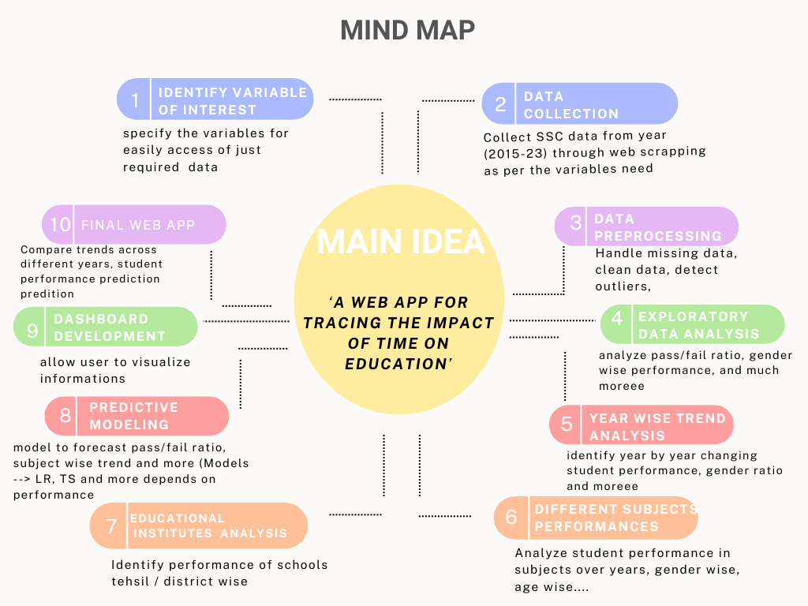

# Final-Year-Project-Idea

## *Tracing the impact of time on education*

#### Table of Contents

1. [Project Aim](#project-aim)
2. [Features / Variable of interest](#features)
3. [End goal of project](#end-goal-of-project)
4. [Few of examples of Dashboard](#few-of-examples-of-Dashboard)
5. [Work Updates](#work-updates)
6. [Example Articles](#example-articles)
7. [Advisor Thoughts](#advisor-thoughts)

# **Project Aim:**
The main aim of this project is to evaluate a comprehensive analysis of student board result data over time. Explore academic performance or related factors that evolved over time.

## Features / Variable of interest:
- District / Tehsil / Town (as many as possible for classification of region)
- urban / rural
- Subjects group
- Obtained and Total marks in each subjects
- Total obtained marks and grand total
- Status (pass / fail)
- School / college name in full
- Enrollment type (Regular / Private)
- Institute type in case of regular student (public or private)
- Failed subjects
- Exam (9th/10th)
- Year of exam
- Gender
- Date of birth

## **Information that we can get from the dataset:**

1. In which year boys got higher marks?
2. In which year girls got higher marks?
3. Total strength of girls and boys (year-wise)
4. In which subject students performed well (subject-wise grading)?
5. What was the position at secondary level?
6. Girls and boys ratio in terms of (science and Arts)
7. Region or Area wise comparison
8. In intermediate, what was the ratio of Pre medical and pre engineering students
9. Evaluation of private and Government schools
10. Fail and supply students ratio and their comparison year wise
11. Repeaters ratio in Intermediate
12. Medical, Engineering, ICS students (merit ratio between them)
13. How many of students appeared in supply exam and how many of not
14. Board students positions (district level)
15. Comparison result of rural and urban areas
16. Pass and fail ratio
17. Illiteracy ratio between rural and urban areas (year wise or on the whole)
18. much moreeee
19. …..

And then prediction….

# End goal of project:

An interactive dashboard for analyzing student performance and education evaluation over time

***What our dashboard will present?***

After getting the dataset and performing all steps then we can specify the metrics which KPI’s (key performance indicators) we want to track from the students board result dataset. 

Like with which we can clearly access progress or can identify areas where improvement is needed . 

### *Basically what my thoughts on representing dashboard will be like:*

- *Our targeted audience could be educational consultants or administrators. With the use of dashboard they can track the overall performance of education in their region, and can track trend of student achievements and can identify where the improvement required.*
- *To make it more user-friendly, will adjust it accordingly to allow user to select and input the variable of interest so that they can choose specific information as per their need. Like if they want to track performance or trend over time they can choose specific year and graphs & will updated accordingly.*

***Some of long term analysis:***

- Pass rate (improving, declining or consistent)
- We can classify gender ratio or age groups (if we get the date of birth of students) changes over time
- subject strengths or weakness
- …….

# **Few of examples of Dashboard:**

This is how we can show our insights - (just an example of sales forecasting) :

[https://blog.streamlit.io/forecasting-with-streamlit-prophet/]

These are few of rough ideas for dashboard presentation, like how we can present student’s outcomes. This is just rough idea, we will adjust it according to our dataset KPI’s or interactive representation:

[https://www.slideteam.net/blog/top-10-education-dashboard-templates-with-examples-and-samples]

This is just example of how to make it more user friendly or interactive by displaying data 3D or visually:

[https://blog.esciencecenter.nl/https-blog-esciencecenter-nl-spot-visual-scientific-data-analytics-made-easy-62e03a895bae]

---

# **Work Updates:**

# **Report #1(A quick basic review of data): (8-11-2023)**

1- **Data Understanding:**

I have explored the dataset of all years from (2015 to 2023). I have just collected basic data info like

- shape of dataset (each year)
- Columns it contains  (each year)
- Unique values and their counts in each column (each year)
- How many different unique subjects in each ‘sub’ column (each year)
- Data types of each columns

## Here’s the Colab notebook for Basic info of data (all years):

[Google Colaboratory](https://colab.research.google.com/drive/1AMS1LyaL_NcIpRyM3tDcjIt79UoPC9i1?usp=sharing)

# **Report #2 (Actual) (11-11-2023):**

1. **Deep Understanding and Exploration of Year 2015 data:**

I have got deeper understanding of year 2015 dataset. Following are the information I got:

- Explored the dataset (number of columns it contains, datatypes of each column, Non null counts)
- Count of null values in each column (A huge number of null values found in subject columns)
- Count of unique values of each column in dataset
- Number of male students was high as compared to female in year 2015
- In 'gazres' columns there are a lot of different unique values other than obtained marks like students who are completely failed, having compart in some of subjects etc..
- The ratio of Regular students was high as compared to private students in year 2015
- Most of the students were from Multan district
- In year 2015, the ratio of Science group students was high as compared to 'Humanities' or 'Deaf and Dumb' group
- Unique Count of each subjects in each ‘sub’ columns
- Bar chart display the count of each subject and marks obtained by students.
- Explored each Group in detail
- Unique subjects in Science group, Humanities group, Deaf and Dumb group with their counts and then display in form of bar chart
- Count Null, or Zero values in each subjects of all 3 groups (science, humanities, deaf & dumb)
- Explored the ‘Gazres’ column because it is containing alot of unique values. Basically, this columns is representing the obtained marks by students

## Here’s the Colab notebook link for this single year exploration:

[Google Colaboratory](https://colab.research.google.com/drive/1QGvNrrwLKrBx8hAixxmmju55GoEL1HCO?usp=sharing)

**Board site from where I explored the Abbreviations of subjects:**

# **Example Articles:**

### *Research papers and Articles I explored*:

**Paper#1: (Case Study)**

[View of Analysis of Grade Inflation at Secondary School Level: Case Study of Board of Intermediate and Secondary Education, Multan](http://pjss.bzu.edu.pk/index.php/pjss/article/view/485/441)

**Short overview of this:**

So this case study is focusing on grade analysis of BISE Multan students from year (2004 to 2013). Their main aim is to investigate the performance of students yearly, their grading trend (gender or discipline wise). Total students of SSC and HSC appeared in exams and what was their grading trend. Further they explored the pass ratio over genders and what was their average marks over the years. They analyzed the most of students were obtained the higher grades (A or B) and their was decrease in lower grade.

**Paper#2: (Research paper)**

[A comparative analysis of assessment schemes in Secondary School Certificate and Cambridge O Level English examination papers in Pakistan: Need for reform](http://ojs.uop.edu.pk/jhss/article/view/385)

**Short overview of this:**

I am reading this research paper, basically it is focusing on comparison between SSC or Cambridge O level. But they are just analyzing the English subject and its question paper of both examination system. What we can do, we can compare the subjects offering in both examination system, the number of students (gender wise distribution) in both system and more. But we don’t need to collect the dataset of Cambridge level students we can compare their already collected information with our collected BISE data. 

# Report#3: (15 Nov)

- I have identified the missing values in the dataset (year 2015)
- Visualized the missing values
- Did some feature engineering
- Identified where most of missing values occurring
- So, it can be seen that most of missing values are in the ‘science’ and ‘Humanity’ group’s subjects.
- Especially science subjects (Phy, Chemistry, Bio, CSC) contains missing values
- Explored the year 2015 subject’s and their total marks from different board sites 9 (to add column in data for better evaluation)
- Did same steps on year 2016 dataset
- Explored google scholars and research gate for research papers related to our topic

## Here’s the colab Notebook link updated: (data 2015)

[https://colab.research.google.com/drive/1QGvNrrwLKrBx8hAixxmmju55GoEL1HCO?usp=sharing]

# **Advisor Thoughts:**

Please brainstorm ideas along two lines:

A. What things to populate on the dashboard? For example:

1. Subject category-wise line chart of grade/score/percentage progression from 2015-2023
2. Bar chart of pass/fail ratio progression from 2015-2023.
3. Progress of schools from 2015-2023.
4. so on… please write all raw ideas here

B. What research questions can be formulated

1. Does gender impact subject choice?
2. Demography (urban/rural) impact grade outcomes?
3. Grades during the COVID period are a significant outlier?
4. Has the COVID period caused a change in the trend of grades for the post-COVID period?
5. Write whatever raw thought comes to your mind.

I am leaving links to articles that you should view to enrich your thoughts along the subject: https://www.tandfonline.com/doi/abs/10.1080/03054980801970312

https://files.eric.ed.gov/fulltext/ED538834.pdf (view article starting on page 23). You may find some other useful articles in the document as well.

